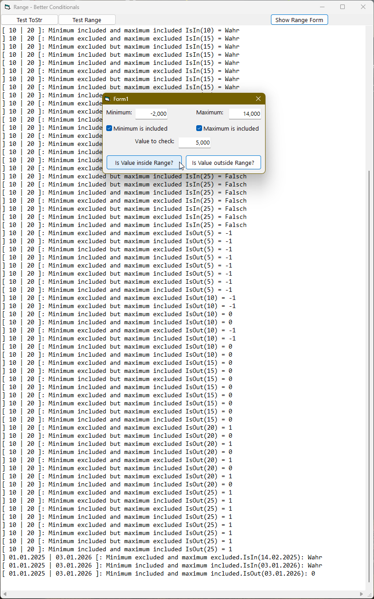

# <App_Name>  
## <App short description>  

[](https://github.com/OlimilO1402/<App_Name>/blob/master/LICENSE) 
[](https://github.com/OlimilO1402/<App_Name>/releases/latest)
[](https://github.com/OlimilO1402/<App_Name>/releases/download/v1.0.0/<App_Name>_v1.0.0.zip)


Range-Checking Made Easy
========================
In General
----------
If we want to check whether an object is part of a set of objects, we just use the function "Contains" of the list that contains all our objects.
Or maybe use the hashing-functionality of a Collection, what could essentially be the same, if your list relies on a Collection-object.

But what if we want to check, if a value of a primitive datatype is inside a specific range between a minimum and a maximum boundary?
If you have a set of only a few specific values of course you can store the values in a list and use the function "contains" as well.
But storing all values inside a list is impossible, if the set is infinite.
Every software developer, sooner or later, comes across the situation of checking whether a value is inside or outside a specific range.
How do we do this? Of course you know, we do this with the help of relational comparison operators like the following:
 * =   Equal to
 * <>  Not Equal to
 * <   Less than
 * >   Greater than
 * <=  Less then or equal
 * >=  Greater than or equal
https://en.wikipedia.org/wiki/Relational_operator
https://de.wikipedia.org/wiki/Vergleichsoperator

OK, so what do we do if we want to check e.g. whether a value falls below the minimum-value of a range.
We could either write:
 * "if value is less then minimunm" or we could write
 * "if value is greater then minimum" or we could write
 * "if minimum is less then value" or we could write
 * "if minimum is greater then value"
 and another 4 possiblities of writing code for checking the maximum value
 and another 8 posibilities of writing code for checking if the boundaries are also included, with less/greater then or equal.

So do we need all those possible operator combinations, well sometimes we use all those operators, just because we can, but should we?

How and Why
-----------
Is there a way of simplifying the situation hence the code and what is the most readable way of writing code with comparison operators?
In western civilisations, most of the time we read from the left hand side to the right hand side, do we?
And also in math most often we assume e.g. in a 2d-graph the 0-center is on the left and the values of the x-axis arise to the right, isn't it?
It turns out the most readable way of writing code is using just a convention that we are already accustomed to:
 * Writing the assumed lesser (lower) value to the left and writing the assumed greater (higher) value to the right
 => the minimum boundary value of our range sits on the left and the maximum boundary value stands on the right.

Math-language
-------------
in math if we state that a value must be inside some range-boundaries we write e.g.:

     (3 < x < 8)

where 3 and 8 are the minimum and maximum boundaries and x is the value in question.

Programming-language
--------------------
The most readable way of writing code is what we are used to anyway, so we write it the same as in math.
In VB (and all other programming languages i know) we have to use a logical "And"-Operator here e.g.:

    (3 < x) And (x < 8)

Other than that the programming language looks quite similar to the "math-language".
in more general words:

   (Minimum < Value) And (Value < Maximum)

Boundaries, Excluding Or Including
----------------------------------
in the above condition "Value" sits right in the middle between Minimum and Maximum. If this condition returns true, our value actually "is in" the range.
Btw of course the operator precedence make the paranthesis obsolete.
Pay attention, in the above code the boundaries are not included. If we also want to include the boundaries we simply
have to use a "<= less then or equal" -operator.

    Minimum <= Value And Value <= Maximum

and if only the maximum boundary should be included we have to write:

    Minimum < Value And Value <= Maximum

and if only the minimum boundary should be included we have to write:

    Minimum <= Value And Value < Maximum

Summary for inside-checking:
 *    Minimum <  Value And Value <  Maximum:  minimum excluded and maximum excluded
 *    Minimum <  Value And Value <= Maximum:  minimum excluded but maximum included
 *    Minimum <  Value And Value <= Maximum:  minimum included but maximum excluded
 *    Minimum <= Value And Value <  Maximum:  minimum included and maximum included

Inside or Outside
-----------------
Until now we just checked if a value is inside a range, but is there another way of range checking?
yes we could also check if a value is outside a range. most readable way of writing the code is similar to above, instead we put Value outside

    Value <= Minimum Or Maximum <= Value

Pay attention to the "Or" now here we have to use the Or-Operator instead of the "And".
Summary for outside-checking:
 *    Value <= Minimum Or Maximum <= Value:  minimum excluded and maximum excluded
 *    Value <= Minimum Or Maximum <  Value:  minimum excluded but maximum included
 *    Value <  Minimum Or Maximum <= Value:  minimum included but maximum excluded
 *    Value <  Minimum Or Maximum <  Value:  minimum included and maximum included

But wait a second isn't this just the opposite of IsIn, so IsOut is just Not IsIn isnt'it?
yes thats true in general, on the other hand asking if a value is *inside* a range can only be answered with yes or no respectivly with true or false.
but asking if a value is *outside* a range could be answered with:
 * "Value is not outside" so it is actually in
 * "or it is outside and falls below the minimum"
 * "or it is outside and exceeds the maximum."

Summary:
* asking if a Value "IsIn" returns true or false
* asking if a Value "IsOut"
   -> returns "0"/false if "in" or
   -> returns negative 1 "-1"/true if value falls below minimum or
   -> returns positive 1 "+1"/true if value exceeds the maximum.

Datatypes
---------
in reality we could come across very different kind of ranges not only range-wise, but also in terms of datatypes.
so far I have in mind ranges of numerical datatypes like "Byte, Integer, Long, Single, Double or Currency" but there could also happen to be
ranges of the datatype "Date". What else can you think of? Please tell me.
In other programming languages we could make use of generics.
In VB we do not have generics, but do we actually need this here?
if yes, of course we could also use the Variant datatype, but should we really use the Variant datatype?
Well, it turns out that using the datatype "Double" is suitable for all the above mentioned ranges of numerical datatypes and also for "Date"-ranges,
because as we know the "Date"-datatype has the same binary representation as the "Double"-datatype, so a "Date" perfectly casts to a "Double".

VB-Code
-------
now that we were so brave and came so far, we finally want to see some VB-Code.
Open VB or VBA or twinBASIC and in a Form-Module we define the range simply by defining the Min and Max boundaries:

```vba  
Option Explicit
Private m_Min As Double
Private m_Max As Double
```  

OK, how do we pay to the fact that we want include or exclude our boundaries?
We could use a Boolean for Minimum and another Boolean for Maximum: excluding = false, including = true
Or we simply define an Enum-datatype because there are only 4 possibilities, like the following:

```vba  
Public Enum ERangeType
    ExMinExMax = 0 ' 0 0
    ExMinInMax = 1 ' 0 1
    InMinExMax = 2 ' 1 0
    InMinInMax = 3 ' 1 1
End Enum
```  

for the sake of completeness and for testing purposes we write:
```vba  
Public Function ERangeType_ToStr(e As ERangeType) As String
    Dim s As String
    Select Case e
    Case ERangeType.ExMinExMax: s = "Exclude Minimum and Exclude Maximum"
    Case ERangeType.ExMinInMax: s = "Exclude Minimum but Include Maximum"
    Case ERangeType.InMinExMax: s = "Include Minimum but Exclude Maximum"
    Case ERangeType.InMinInMax: s = "Include Minimum and Include Maximum"
    End Select
    ERangeType_ToStr = s
End Function
```  
So we complete our variables with a variable of ERangeType

```vba  
Option Explicit
Private m_Min As Double
Private m_Max As Double
Private m_Typ As ERangeType
```  

now we finally are able to write down the complete functions "IsIn" and "IsOut"

```vba  
Public Function IsIn(ByVal Value As Double) As Boolean
    'returns true if Value is inside the range otherwise false
    Select Case m_Typ
    Case ERangeType.ExMinExMax: IsIn = m_Min < Value And Value < m_Max
    Case ERangeType.ExMinInMax: IsIn = m_Min < Value And Value <= m_Max
    Case ERangeType.InMinExMax: IsIn = m_Min <= Value And Value < m_Max
    Case ERangeType.InMinInMax: IsIn = m_Min <= Value And Value <= m_Max
    End Select
End Function

Public Function IsOut(ByVal Value As Double) As Integer
    'we also want to return if the Value falls below Min or if it exceeds Max
    'returns 0 / false if Value is "in" resp is "not out" the range
    'returns -1 / true if Value falls below min
    'returns 1 if Value exceeds max
    Select Case m_Typ
    Case ERangeType.ExMinExMax: IsOut = IIf(Value <= m_Min Or m_Max <= Value, IIf(Value <= m_Min, -1, 1), 0)
    Case ERangeType.ExMinInMax: IsOut = IIf(Value <= m_Min Or m_Max < Value, IIf(Value <= m_Min, -1, 1), 0)
    Case ERangeType.InMinExMax: IsOut = IIf(Value < m_Min Or m_Max <= Value, IIf(Value < m_Min, -1, 1), 0)
    Case ERangeType.InMinInMax: IsOut = IIf(Value < m_Min Or m_Max < Value, IIf(Value < m_Min, -1, 1), 0)
    End Select
End Function
```  

If we only need a boolean we could write

```vba  
Public Function IsOut(ByVal Value As Double) As Boolean
    Select Case m_Typ
    Case ERangeType.ExMinExMax: IsOut = Value <= m_Min Or m_Max <= Value
    Case ERangeType.ExMinInMax: IsOut = Value <= m_Min Or m_Max < Value
    Case ERangeType.InMinExMax: IsOut = Value < m_Min Or m_Max <= Value
    Case ERangeType.InMinInMax: IsOut = Value < m_Min Or m_Max < Value
    End Select
End Function
'Or maybe if we only need a boolean we could also write:
Public Function IsOut(ByVal Value As Double) As Boolean
    IsOut = Not IsIn(Value)
End Function
```  

OK and last but not least we want to have a String representation of our range maybe just for debugging-reasons:
for the range we use the "[" and "]" rectangle parenthesis and we flip the parenthesis if the boundary is excluded

```vba  
Public Function ToStr(Optional FormatAsTyp As VbVarType = vbDouble) As String
    Dim pl As String: pl = IIf((m_Typ And 2) = 2, "[ ", "] ")
    Dim pr As String: pr = IIf((m_Typ And 1) = 1, " ]", " [")
    ToStr = ERangeType_ToStr(m_Typ) & ": " & pl & FormatRange(FormatAsTyp, m_Min, m_Max) & pr
End Function

Private Function FormatRange(ByVal vt As VbVarType, ByVal Min As Double, ByVal Max As Double) As String
    Dim s As String
    Select Case vt
    Case VbVarType.vbDate
        Dim datMin As Date: datMin = Min
        Dim datMax As Date: datMax = Max
        s = datMin & " | " & datMax
    Case Else
        s = Min & " | " & Max
    End Select
    FormatRange = s
End Function
```  

OK, of course we want to have reusable code so we like to copy all the above code into a class.
We could name it "Range" or maybe "RangeCheck" if we want to use this class also in Excel-VBA.

```vba  
' v ' ################################################################################################# ' v '
Option Explicit
Private m_Min As Double
Private m_Max As Double
Private m_Typ As ERangeType

Friend Sub New_(MinValue As Double, MaxValue As Double, RangeType As ERangeType)
    m_Min = MinValue: m_Max = MaxValue: m_Typ = RangeType
End Sub

'copy to MNew:
'Public Function Range(ByVal MinValue As Double, ByVal MaxValue As Double, ByVal RangeType As ERangeType) As Range
'    Set Range = New Range: Range.New_ MinValue, MaxValue, RangeType
'End Function

Public Function IsIn(ByVal Value As Double) As Boolean
    'returns true if Value is inside the range otherwise false
    Select Case m_Typ
    Case ERangeType.ExMinExMax: IsIn = m_Min < Value And Value < m_Max
    Case ERangeType.ExMinInMax: IsIn = m_Min < Value And Value <= m_Max
    Case ERangeType.InMinExMax: IsIn = m_Min <= Value And Value < m_Max
    Case ERangeType.InMinInMax: IsIn = m_Min <= Value And Value <= m_Max
    End Select
End Function

Public Function IsOut(ByVal Value As Double) As Integer
    'returns 0/false if Value is "in" resp is "not out" the range
    'returns -1/true if Value falls below min
    'returns  1/true if Value exceeds max
    Select Case m_Typ
    Case ERangeType.ExMinExMax: IsOut = IIf(Value <= m_Min Or m_Max <= Value, IIf(Value <= m_Min, -1, 1), 0)
    Case ERangeType.ExMinInMax: IsOut = IIf(Value <= m_Min Or m_Max < Value, IIf(Value <= m_Min, -1, 1), 0)
    Case ERangeType.InMinExMax: IsOut = IIf(Value < m_Min Or m_Max <= Value, IIf(Value < m_Min, -1, 1), 0)
    Case ERangeType.InMinInMax: IsOut = IIf(Value < m_Min Or m_Max < Value, IIf(Value < m_Min, -1, 1), 0)
    End Select
End Function

Public Function ToStr(Optional FormatAsTyp As VbVarType = vbDouble) As String
    Dim pl As String: pl = IIf((m_Typ And 2) = 2, "[ ", "] ")
    Dim pr As String: pr = IIf((m_Typ And 1) = 1, " ]", " [")
    ToStr = ERangeType_ToStr(m_Typ) & ": " & pl & FormatRange(FormatAsTyp, m_Min, m_Max) & pr
End Function
 ^ ################################################################################################# ^ '
```  

OK are we ready now? Maybe not, if we listen to what my namesake Scott Meyers has to say:
 From Effective C++, by Scott Meyers :
 "Anytime you find yourself writing code of the form "if the object is of type T1, then do something, but if it's of type T2, then do something else," slap yourself.

Implements interface
--------------------
We are guilty because we broke the rule! Do we want to slap ourselfs? Nope, of course not!
So where have we become guilty, and what do we do about it?
Well imagine we have many thousands of values to range-check. For every value to check we have to go through the Statement "Select Case m_Typ"
We could optimise it by using four different classes and an Interface:
The interface could look like:

```vba  
Option Explicit
'Class Interface named: "IRange"
Public Function IsIn(ByVal Value As Double) As Boolean:  End Function
Public Function IsOut(ByVal Value As Double) As Integer: End Function
Public Function ToStr(Optional FormatAsTyp As VbVarType = vbDouble) As String: End Function
```  

We name the 4 classes like:
 * RangeExMinExMax
 * RangeExMinInMax
 * RangeInMinExMax
 * RangeInMinInMax

here e.g. the Class RangeExMinInMax, the other classes accordingly:

```vba  
Option Explicit
Implements IRange
Private m_Min As Double
Private m_Max As Double

Friend Sub New_(RangeMin As Double, RangeMax As Double)
    m_Min = RangeMin: m_Max = RangeMax
    If m_Min <= m_Max Then Exit Sub
    m_Min = RangeMax: m_Max = RangeMin
End Sub

Private Function IRange_IsIn(ByVal Value As Double) As Boolean
    'returns true if Value is inside the range otherwise false
    IRange_IsIn = m_Min < Value And Value <= m_Max
End Function

Private Function IRange_IsOut(ByVal Value As Double) As Integer
    'returns 0 / false if Value is "in" resp is "not out" the range
    'returns -1 / true if Value falls below min
    'returns 1 if Value exceeds max
    IRange_IsOut = IIf(Value <= m_Min Or m_Max < Value, IIf(Value <= m_Min, -1, 1), 0)
End Function

Private Function IRange_ToStr(Optional FormatAsTyp As VbVarType = vbDouble) As String
    IRange_ToStr = ERangeType_ToStr(ERangeType.ExMinInMax) & ": " & "] " & FormatRange(FormatAsTyp, m_Min, m_Max) & " ]"
End Function
```  

[Link text Here](https://link-url-here.org) 


